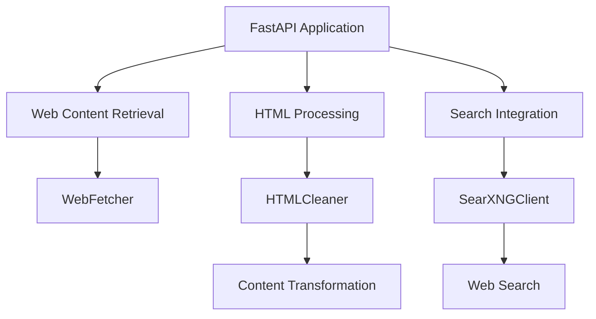
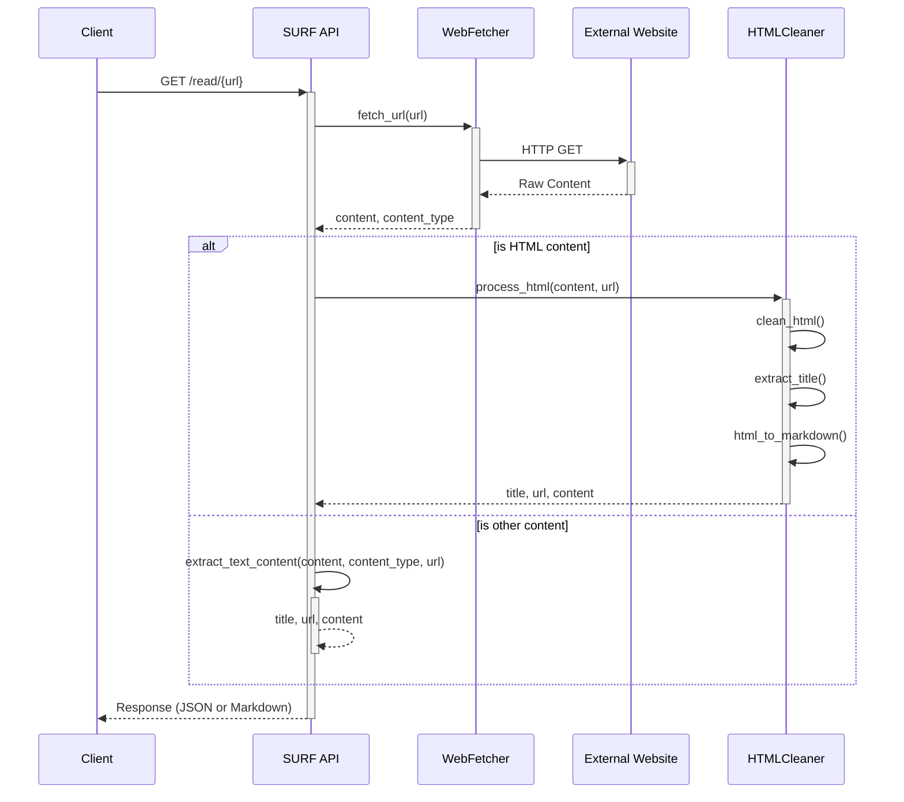
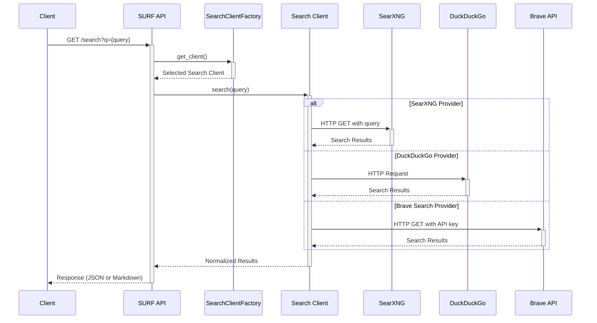

# SURF API Architecture

This document provides a comprehensive overview of the SURF API architecture, its components, and how they interact.

## Overview

SURF is designed with a modular architecture that separates concerns between web content retrieval, processing, and presentation. The system consists of several key components:

1. **API Layer**
   - RESTful endpoints for content retrieval and search
   - Request validation and error handling
   - Authentication and rate limiting
   - Output formatting (JSON, Markdown)

2. **Content Processing Pipeline**
   - Web content fetching with timeout handling
   - HTML cleaning and normalization
   - Content extraction with structure preservation
   - Format conversion (HTML to Markdown/JSON)

3. **Search Integration**
   - Multiple search provider support
   - Query construction and parameter handling
   - Result normalization and ranking
   - Pagination and filtering

4. **Configuration System**
   - Environment-based configuration
   - Default settings with override capability
   - Logging and diagnostics

## System Overview

SURF is designed with a modular architecture that separates concerns between web content retrieval, processing, and presentation. The system consists of several key components:



If the diagram above doesn't display properly, you can view it here:


### Components

1. **FastAPI Application Layer**
   - Handles HTTP requests and routing
   - Manages API endpoints and request validation
   - Provides OpenAPI documentation

2. **Web Content Retrieval**
   - `WebFetcher`: Fetches content from web URLs
   - Handles different content types, timeouts, and errors
   - Implements rate limiting and size constraints

3. **HTML Processing**
   - `HTMLCleaner`: Transforms HTML into clean, structured content
   - Handles tables, lists, code blocks, and other formatting
   - Extracts key metadata like page title

4. **Search Integration**
   - `SearchClientFactory`: Provides the appropriate search client based on configuration
   - Multiple search provider support:
     - `DuckDuckGoClient`: Default search provider with no API key required
     - `SearXNGClient`: Private metasearch engine option
     - `BraveSearchClient`: Commercial search API option
   - Normalized results across all providers for consistent API response

5. **Configuration Management**
   - Environment-based configuration
   - Sensible defaults with override capability

## Data Flow

### Read Endpoint Flow

1. Client sends request to `/read/{url}?format=[json|md]`
2. URL is validated and normalized
3. `WebFetcher` retrieves content from the URL
4. Content type is detected and appropriate processor is selected
5. For HTML content:
   - `HTMLCleaner` removes unnecessary elements
   - Content is transformed to markdown
   - Title, URL, and processed content are gathered
6. For non-HTML content:
   - Content is processed according to its type
   - JSON is pretty-printed, text is passed through, etc.
7. Response is formatted according to requested format and returned

Sequence diagram for the read endpoint:



If the diagram above doesn't display properly, you can view it here:


### Search Endpoint Flow

When a user sends a request to the `/search` endpoint:

1. Request is received and validated
2. Query is validated
3. Based on configuration, the appropriate search client is selected via `SearchClientFactory`
4. The search client performs the search with the query
5. Search results are fetched, normalized, and returned
6. Results are formatted according to requested format and returned

Sequence diagram for the search endpoint:



If the diagram above doesn't display properly, you can view it here:


## Key Classes and Interactions

### `WebFetcher`

Responsible for retrieving content from URLs:

```python
class WebFetcher:
    MAX_CONTENT_SIZE = 10 * 1024 * 1024
    TEXT_CONTENT_TYPES = [...]
    
    @staticmethod
    async def fetch_url(url: str, timeout: int = 30) -> Optional[Tuple[str, str]]:
        # ...implementation...
```

### `HTMLCleaner`

Processes HTML content for optimal LLM consumption:

```python
class HTMLCleaner:
    @staticmethod
    async def clean_html(html_content: str, base_url: str = '') -> BeautifulSoup:
        # ...implementation...
        
    @staticmethod
    async def html_to_markdown(soup: BeautifulSoup) -> str:
        # ...implementation...
        
    @classmethod
    async def process_html(cls, html_content: str, base_url: str = '') -> dict:
        # ...implementation...
```

### `SearchClientFactory`

Factory for creating search client instances based on configuration:

```python
class SearchClientFactory:
    @staticmethod
    def get_client() -> Union[SearXNGClient, DuckDuckGoClient, BraveSearchClient]:
        # ...implementation...
```

### `SearXNGClient`, `DuckDuckGoClient`, and `BraveSearchClient`

Handle web search functionality through different providers:

```python
class SearXNGClient:
    def __init__(self):
        # ...implementation...
    async def search(self, query: str, num_results: int = None) -> list:
        # ...implementation...

class DuckDuckGoClient:
    def __init__(self):
        # ...implementation...
    async def search(self, query: str, num_results: int = None) -> list:
        # ...implementation...
        
class BraveSearchClient:
    def __init__(self):
        # ...implementation...
    async def search(self, query: str, num_results: int = None) -> list:
        # ...implementation...
```

## Optimization Strategies

SURF implements several optimization strategies:

1. **Asynchronous Processing**: All I/O operations use `async`/`await` for optimal performance
2. **Content Cleaning**: Removes unnecessary elements from HTML to reduce tokens used by LLMs
3. **Timeout Management**: Configurable timeouts prevent hanging on slow websites
4. **Size Limits**: Content size limits prevent memory issues with large pages
5. **Text-Only Focus**: Binary content is recognized and handled appropriately
6. **Error Handling**: Comprehensive error handling with graceful fallbacks

## Security Considerations

1. **URL Validation**: All URLs are validated before processing
2. **Content Type Checking**: Only appropriate content types are processed
3. **Size Limitations**: Prevents denial-of-service through massive content
4. **Authentication**: Support for SearXNG authentication
5. **No Direct Content Execution**: Content is never executed, only processed as text

## Extensibility

SURF is designed for extensibility:

1. **Modular Design**: Each component can be replaced or extended
2. **Clear Interfaces**: Components interact through well-defined interfaces
3. **Configuration System**: Extensive configuration options without code changes
4. **Content Type Handlers**: System for handling different content types
5. **Format Converters**: Flexible output format system

## Deployment Considerations

### Resource Requirements

- **CPU**: Minimal for API serving, moderate for content processing
- **Memory**: Depends on maximum content size (default 10MB)
- **Disk**: Minimal (~50MB for code and dependencies)
- **Network**: Moderate bandwidth for web content retrieval

### Scaling

SURF can be scaled in several ways:

1. **Horizontal Scaling**: Deploy multiple instances behind a load balancer
2. **Vertical Scaling**: Increase resources for handling more concurrent requests
3. **Caching Layer**: Add Redis or similar for caching frequently accessed content

### Monitoring

Important metrics to monitor:

1. **Request Latency**: Time to process requests
2. **Error Rates**: Failed requests by type
3. **Content Size**: Distribution of retrieved content sizes
4. **External Service Health**: Search provider availability (SearXNG, DuckDuckGo, Brave)
5. **Memory Usage**: Especially during large content processing